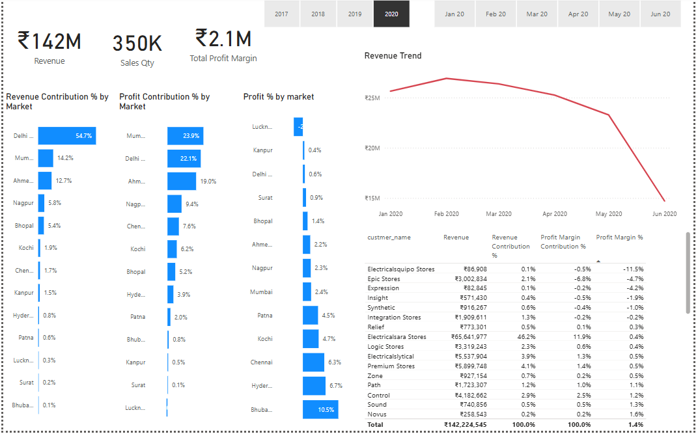

# 📊 Sales Trends Dashboard

This repository contains my **Sales Trends Dashboard**, a Power BI project designed to help businesses track sales performance, uncover trends, and make data-driven decisions faster.

---

## ⭐ Project Overview (STAR Method)

**Situation:**  
The sales team and leadership lacked a unified view of daily, weekly, and monthly sales data. Reports were scattered across spreadsheets and manual updates wasted valuable time, making it hard to detect sales patterns and trends.

**Task:**  
I set out to design and build an interactive dashboard that centralizes all sales data, visualizes performance trends over time, and provides flexible filters for deep dive analysis.

**Action:**  
- Collected and cleaned historical sales data.
- Designed time series charts to show sales growth and trends.
- Added slicers and filters for product categories, regions, and date ranges.
- Automated data refresh to keep the dashboard up-to-date with minimal manual effort.
- Focused on an intuitive, clean user experience so anyone — from sales reps to managers — can use it with zero friction.

**Result:**  
The Sales Trends Dashboard now empowers the team to spot performance trends at a glance, compare sales across regions and products, and make timely decisions. By automating reporting, it saves the team hours each week and turns static data into actionable insights.

---

## ⚙️ Key Features

- 📈 **Time Series Charts:** Visualize sales performance and growth patterns.
- 🎛️ **Dynamic Filters:** Slice data by product line, region, and time period.
- 🔄 **Automated Updates:** Scheduled refreshes ensure real-time data availability.
- 🧩 **Clean UI:** Easy to navigate for technical and non-technical users alike.

---

## 🗂️ Files Included

- `Sales_Trends_Dashboard.pbix` — Power BI dashboard file.
- `data/` — Example CSV or Excel data (if applicable).
- `screenshots/` — Visuals showcasing the dashboard.

---

## 🖼️ Screenshots

